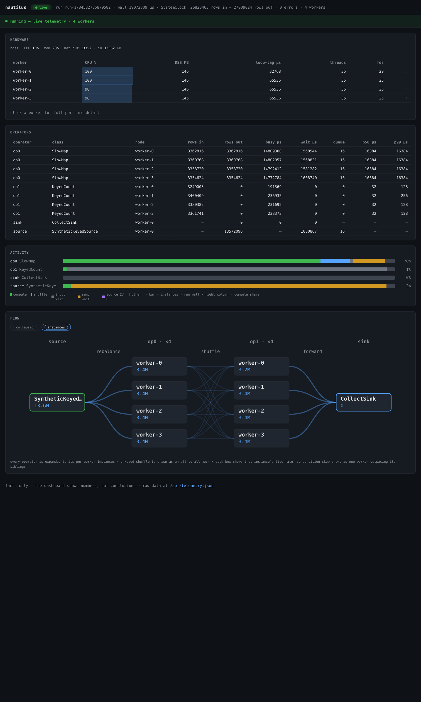

# The live dashboard

`nautilus dashboard <pipeline>` runs a pipeline and serves a live telemetry dashboard over HTTP: one page
that refreshes as the run proceeds, aggregated across every worker when the run is distributed. Point it at
a job to answer one question while it is still running — **where is the time going?** For the command's
options (`--port`, `--workers`, telemetry tier), see the [CLI reference](cli-reference.md#dashboard).

The dashboard reports measured numbers and stops there — it never labels a stage "slow" or a run
"healthy." Reading the panels is the analysis, and that part is yours. Here is what each one is telling you.

## Hardware

Per-process resource use. A distributed run shows the host's CPU and memory once, then a compact row per
worker — CPU%, resident memory, event-loop lag, and thread / file-descriptor counts. **Click a worker** to
open its full per-core cards with rolling sparklines. Event-loop lag climbing on one worker means its async
loop is being starved — usually a CPU-bound stage holding it — even while that worker's CPU reads busy.

## Operators

One row per operator instance; the `node` column names the worker it runs on. Read a row across:

- **rows in → rows out** is the stage's selectivity — a fan-out (tokenize) or a fan-in (aggregation) shows
  as the two diverging.
- **busy µs vs wait µs** separates compute from blocking. A stage with high *wait* is stalled on a full
  downstream channel (backpressure), not doing work; the one with high *busy* is where the CPU goes.
- **queue** is the deepest its input channel reached. At capacity with nonzero wait, it is a bottleneck —
  follow it downstream to the stage that is not draining.
- **p50 / p99 µs** are per-batch processing times; a wide gap is a few slow batches, not a uniformly slow
  stage.

Each column's underlying metric is defined in the [telemetry reference](telemetry-reference.md).

## Activity

Each operator's share of the run's wall, split into where that time went: **compute**, the keyed-shuffle
**route**, **input wait**, **send wait** (backpressure), and a source's **I/O**. It is the occupancy lens
made visual. The stage that gates the run but reads mostly *wait* is not the one to speed up — the stage
that is mostly *compute* is where the run actually spends itself.

## Flow

The dataflow graph, live: dots trace rows crossing each channel, a line thickens with the rows it has
carried, and its stroke turns amber as that channel's queue fills toward capacity. A distributed run adds a
**toggle**:

- **collapsed** — one node per operator, the logical pipeline.
- **instances** — every operator expanded into its per-worker tasks, with edges drawn the way the
  partitioner moves rows: a fan-out, a gather, or an **all-to-all mesh** for a keyed shuffle — the
  cross-worker traffic the collapsed view hides. Each box carries that instance's live rate, so a hot
  partition reads at a glance as one worker's box outpacing its siblings.

## Errors

Hidden until an operator raises, then it lists the operator, the phase, and the exception — so a failing
run is never silent.
