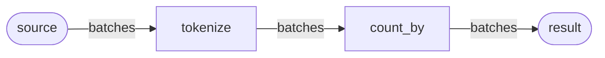
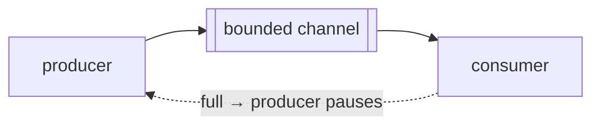
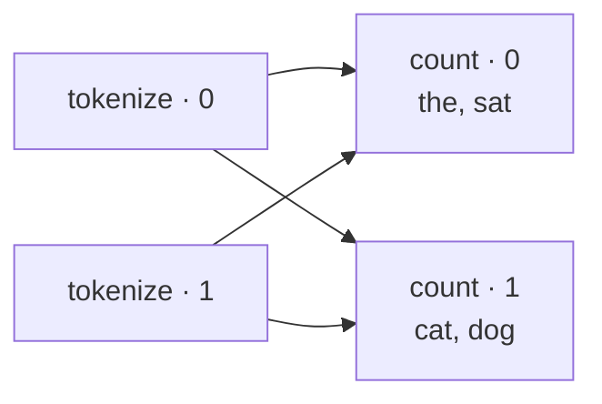
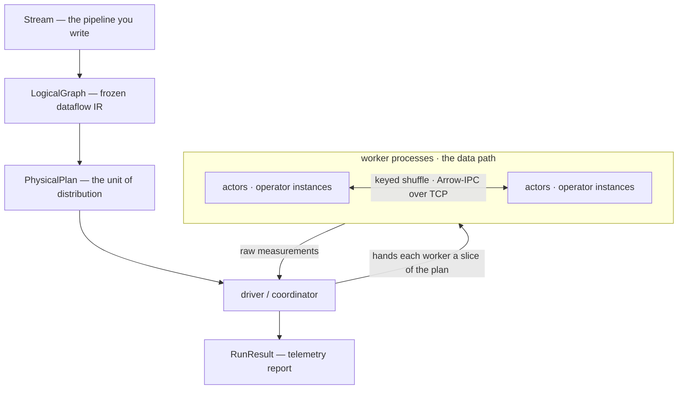

# Concepts

A Nautilus program is a **graph of small operators** that data streams through. This page explains the
model; for the full rationale and invariants, see the [design document](https://github.com/geospatial-jeff/nautilus/blob/main/DESIGN.md).

## A pipeline is a dataflow graph

Each combinator you chain — `map`, `filter`, `join`, `count_by` — adds one **operator** to a graph. An
operator reads batches from its input, does its work, and emits batches to its output. The graph is fixed
before the run starts and doesn't change while it runs.

Data travels along the edges as Arrow **batches** — columnar chunks of rows, passed by reference between
operators in the same process and serialized once when they cross to another. Building the graph does
nothing on its own; a terminal (`run()` or `collect()`) compiles it and pushes data through.

## Everything streams

No stage gathers the whole dataset before the next begins. Each operator processes a batch and hands it
on, so a run's memory is set by how many batches are in flight, not by input size — a pipeline over a 1 TB
file holds no more than one over a 1 MB file. The same operators handle a finite file and an unbounded
stream; a source just produces batches until it stops.

## Backpressure, end to end

Streaming has a risk: a stage faster than the one after it produces batches quicker than they're consumed,
and unbounded they pile up until memory is exhausted. Nautilus uses **bounded** channels between operators
— when a consumer's channel fills, the producer's next send blocks until there's room.

The fast stage is paused by the slow one automatically, and the pause propagates back to the source. You
configure nothing; memory stays flat however long the stream runs.

## Scaling out

Two separate dials control how a pipeline runs. **`parallelism`** is how many instances of each operator
exist. **`workers`** is how many OS processes those instances run in; the default is one, so everything
runs in the current process.

They're separate because they buy different things. Instances in one process (`parallelism` alone) run as
async tasks in a single event loop: they overlap **I/O** — a network source's awaits interleave — but
share the GIL, so they add no CPU. `workers` spawns processes, which is what actually uses multiple cores
(and, with a `daemons` roster, multiple machines). So reach for `parallelism` to speed up an I/O-bound
pipeline cheaply, and `workers` to saturate cores:

| Call | Instances per operator | Processes |
|---|---|---|
| `run()` | 1 | 1 |
| `run(parallelism=4)` | 4 | 1 (all in-process) |
| `run(workers=4)` | 4 | 4 (one instance each) |
| `run(workers=2, parallelism=8)` | 8 | 2 (four instances each) |

`run(workers=N)` defaults `parallelism` to `N`, so scaling out needs a single number.

Whatever the width, the graph you wrote is unchanged. A stateless step like `map` processes different
batches on different instances. A **keyed** step like `count_by` or `join` needs every row with the same
key in one place, so its input is **shuffled**: each row is routed to an instance by a hash of its key.

Every occurrence of a word lands on the same counter, so the result is identical at any width.

## Decentralized

There is no central scheduler handing out work. Each operator instance is an actor that runs its own loop
and routes finished batches straight into the next operator's channel. Coordination happens only at the
edges — starting up, and the end-of-stream barrier that tells an operator its input is complete — so
nothing sits between operators as they pass batches.

## Telemetry

Every run records measurements about itself — rows in and out, time spent, queue depth, per operator.
Reading them shows where a pipeline spends its time and where it stalls: a stage with high busy time is
compute-bound, while a stage that spends its time waiting to send is blocked on a slower consumer
downstream. The [telemetry reference](telemetry-reference.md) lists every metric.

## Advanced

Under the model above, a `Stream` lowers **once** into a frozen plan — and that plan, not your Python, is
what runs. This compile is the only centralized step; the run itself is decentralized.

The driver hands each worker a slice of the plan and folds the measurements it returns into one report.
The plan is a self-contained, serializable value, so it runs unchanged in one process or across many
machines.

!!! info "Full design"
    The [design document](https://github.com/geospatial-jeff/nautilus/blob/main/DESIGN.md) covers the
    eight core mechanisms: the single-writer state model, the end-of-stream barrier, and credit-based
    transport among them.
